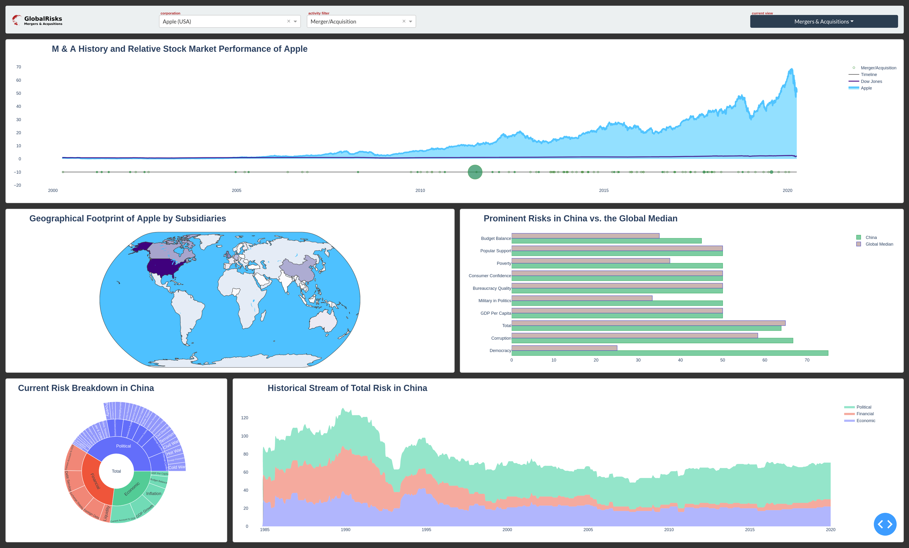

# GlobalRisk
Visualization of Global Risk of US Corporations



```
@dash.callback(
    [
        O('total-plot', 'figure')
    ],
    [
        I('world-plot', 'clickData')
    ]
)
def makePlot_Total(code) :

    if  not all([code]) :
        return waitMake('Select Country from Map', 'Prominent Risks in Selected Country vs. the Global Median')

    code  = code['points'].pop()['location'] if code else ''
    name  = data['cnmap' ][code]             if code else 'Country'

    risks = data['risks']
    final = risks.date.max()

    latest_country = risks[risks.date.eq(final)&
                           risks.code.eq(code)]

    median_country = latest_country.groupby('nick').perc.median().sort_values(ascending = False)

    latest_world   = risks[risks.date.eq( final)&
                           risks.nick.isin(median_country.index.tolist()[:10])]

    median_world   =   latest_world.groupby('nick').perc.median()

    x0     = median_country.index.tolist()[:10]
    y0     = median_country.values.tolist()[:10]
    x1     = median_world.index.tolist()
    y1     = median_world.values.tolist()

    trace0 = \
    Bar(
        x      = y0,
        y      = x0,
        marker =
        {
            'color' : 'rgba(50, 171, 96, 0.6)',
            'line'  :
            {
                'color' : 'rgba(50, 171, 96, 1.0)',
                'width' : 1
            }
        },

        name        = f'{name}',
        orientation = 'h',
    )

    trace1 = \
    Bar(
        x      = y1,
        y      = x1,
        marker =
        {
            'color' : 'rgba(170, 131, 126, 0.6)',
            'line'  :
            {
                'color' : 'rgba(70, 71, 196, 1.0)',
                'width' : 1
            }
        },

        name        = 'Global Median',
        orientation = 'h',
    )

    layout = \
    Layout(
        title                = f'<b>Prominent Risks in {name} vs. the Global Median<b>',
        yaxis_showgrid       = False,
        yaxis_showline       = False,
        yaxis_showticklabels = True,

        xaxis_zeroline       = False,
        xaxis_showline       = False,
        xaxis_showticklabels = True,
        barmode              = 'group',
    )

    return [upFigure(traces = [trace0, trace1], layout = layout, margin = (60,40,140,160))]
```